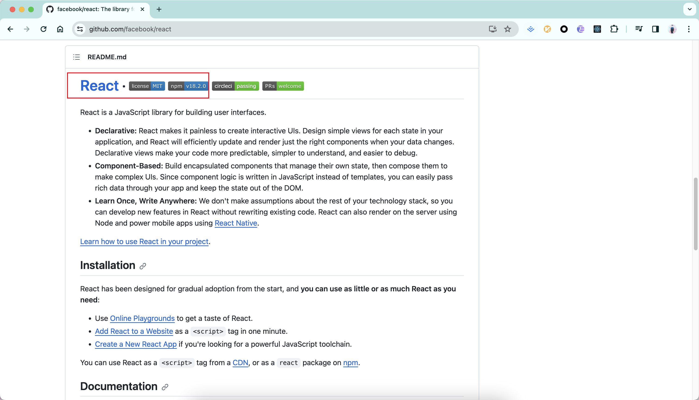

### React 源码打包并引用

  

- clone 官方地址 `github.com/facebook/react`

- 基于最新正式版的tag: 18.2.0创建自己的分支, 便于后续的提交修改

- `yarn install`安装依赖可能会报错, 因为依赖`jdk`和`electron`(因为 RN 需要)

- 执行打包命令:
  `yarn build react/index,react/jsx,react-dom/index,scheduler --type=NODE_DEV`

- 打包好的文件, 分别进入`react` `react-dom`, 执行`yarn link`创建本地连接

- 使用 `npx create-react-app cra`创建一个普通的 react 项目,
  并执行 `yarn link react/react-dom`使用打包出来的内容

- 跑测试用例:
  `yarn test ./packages/scheduler/src/__tests__/Scheduler --watch`
