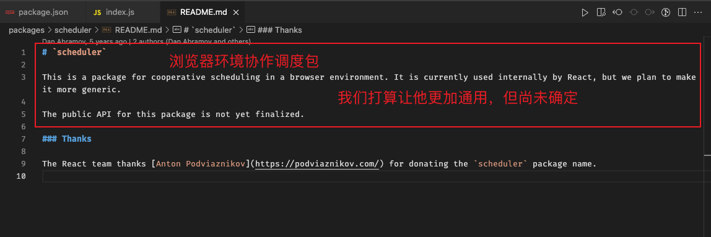

## 从 react 中单词说起

- `Impl` implement 实现, 表示具体函数的实现
  `Discrete` 离散(事件)
  `Continuous` 连续(事件)
  `Perform` 与执行相关
  `Actual` 实际(表现)的, 用于开发环境性能统计
  `alternate` 双缓存中 备份 的字段
  `workInProgress` 和 `current` 与双缓存有关
  `workInProgress` 和 `workInProgressRoot` 和 `workInProgressHook` wip 表示的是当前正处理的
  `Scheduler` 调度器
  `Reconcile` 协调
  `Commit` 提交
  `Element` 指由 jsx 编译的结果
  `Fiber` 纤程/协程, 这里指一个单位的元素映射
  `Priority` 优先级, 调度任务和事件优先级
  `Lane(s)` 赛道, 是 fiber 优先级模型

## 前提常识

- 当前使用版本为正式发版的 `18.2.0`, 旧版指 fiber 模型前的的版本(react16)

- 有很多文件分为`old.js`、 `new.js` 后者是过渡尝试新的特性, 我们统一使用`old.js`版本

- `scheduler` 是独立的包, 是通用的调度算法, 与 React 没有直接关系, React 通过 fork 其进行二次适配开发
  

- `React` 与 `React-dom` 前者只提供`最底层平台无关`的内容; 后者是在浏览器平台的具体实现
  两者关系类似与: `Chromium` 与 `Chrome`

- `FiberRoot` 与 `RootFiber` 非常容易搞混 (前者应该改名成 reactRoot 或 appRoot)
  前者的重心在 root 上, 表示整个应用的根; 后者重心在 fiber 上, 表示 fiber 树的根 (具体后面), ReactDOM.createRoot().render

- React18不再支持IE, 因为使用了许多现代浏览器的特性

- React项目结构(Monorepo):
  `1.react - 宿主环境无关的运行时基础代码, 类比linux内核代码`
  `2.react-reconciler - 协调器, 将输出信号传递给渲染器执行具体渲染`
  `3.scheduler - 通用的任务调度器, react通过fork进行二次开发`
  `4.react-dom - 浏览器宿主环境渲染器, 类比linux的发行版: Ubuntu`
  `5.react-noop - 专门用于测试的渲染器`