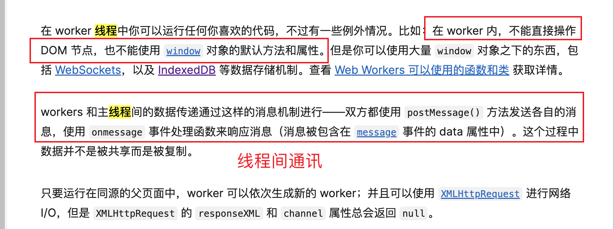
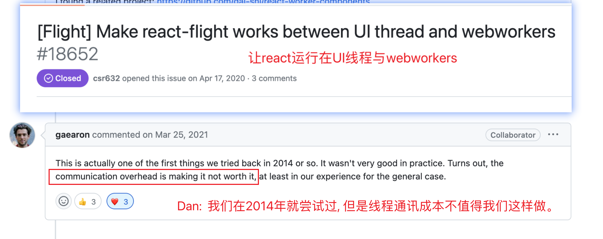
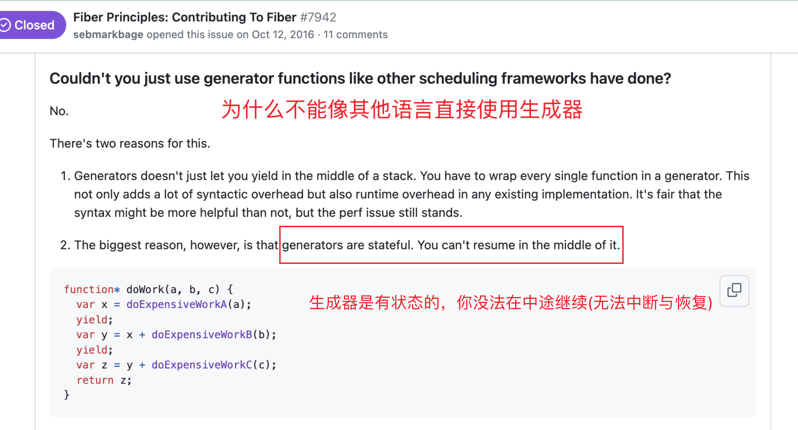
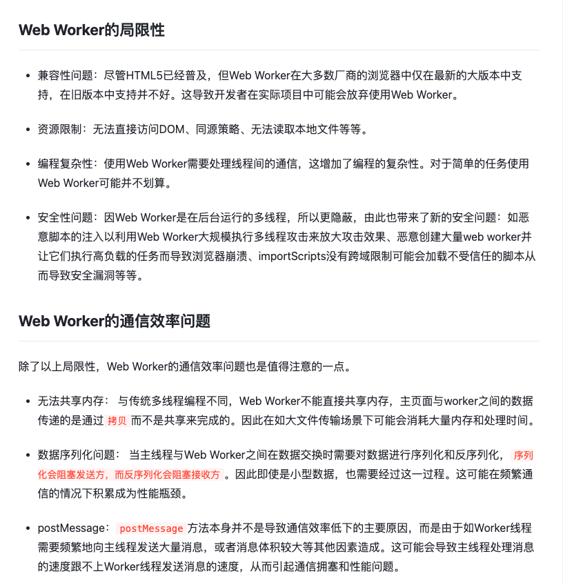

### 单线程(天花板同时也是优势)

- js 的执行与页面渲染是共用线程的(单线程), 两者无法同时执行, 一旦 js 的执行时间过长就会造成页面卡顿!

- React 所有设计都是以这个`大前提`进行设计的, React 要做的就是在这个限制下做出思考如何设计的更好

### 课外补充: 是否可以引入 webWorker(多线程) 或 generator(多协程) 来解决这个问题?

- 答案是 React 很早尝试过, 最终放弃了这两个方案,

  1. 放弃 worker 是因为它无法直接访问 dom 页面, 并且多线程协作的开销和代码复杂程度太高。

  
  
  具体可以看这个issue: https://github.com/facebook/react/issues/18652

  2. 放弃 generator 是因为它有状态、不利于中断与恢复, 并且 React 不能完全控制

  
  后来 React 参考协程的颗粒度设计了 fiber, 想要深入了解的强烈推荐看下这个 issue
  [Fiber Principles](https://github.com/facebook/react/issues/7942)

- 为什么 webWorker 没有大规模推广? 因为除了少数的运算密集场景, 前端多线程大多时候都是伪需求。
  `执行速度`大多数时候都不是开发瓶颈，也不是用户关注的重点 (很多页面卡顿都是设计的问题)

  

### React18 中的设计理念与支撑模型

- 为了快速响应用户交互, 降低 CPU 和 UI 的阻塞, 框架层面实现了异步更新机制
  同步异步对比: `同步更新更快, 异步更新更流畅`; 人是很难觉察得到低延迟, 但异步却能带来很大的设计空间
  简单说: 就是同步更新变成可中断的异步更新; 官方说法是栈协调变 fiber 协调。

- 顶层特性表现为: `Concurrent` `Transition` `Suspense`
  中级特性表现为: `任务可中断可恢复`, 可以`批量更新`
  底层支撑机制为: `时间切片` `离散宏任务` `lanes`

- 为了支撑上面这套设计, React 主要参考了`分时操作系统` `浏览器requestIdleCallback`, 实现了大量的机制模型, 代码非常复杂
  简单说就是 React 实现了自己的 `mini OS`

- 而所谓的`任务调度、fiber 树、双缓存、时间切片、Lanes 赛道、diff 算法`...都是为了实现上面的理念, 而自然产生的底层支撑模型。

- 旧版 React 为什么不能满足核心需求了? 同步更新 + 栈协调, 性能瓶颈突破不了, 最终选择了大幅重构(React16 -> React18)。
  在某些场景, 新版 React 批量更新能将 `O(n)`的更新时间复杂度, 降低到 `O(1)`
