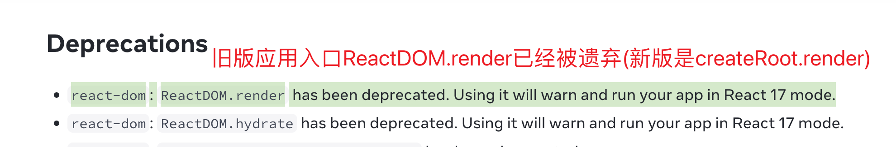
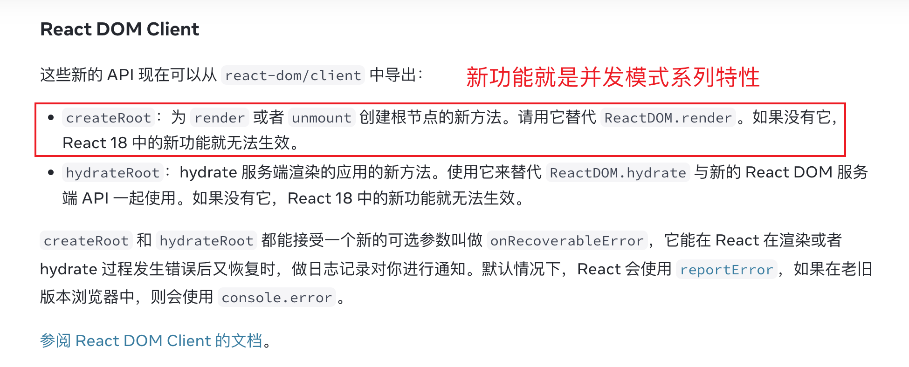
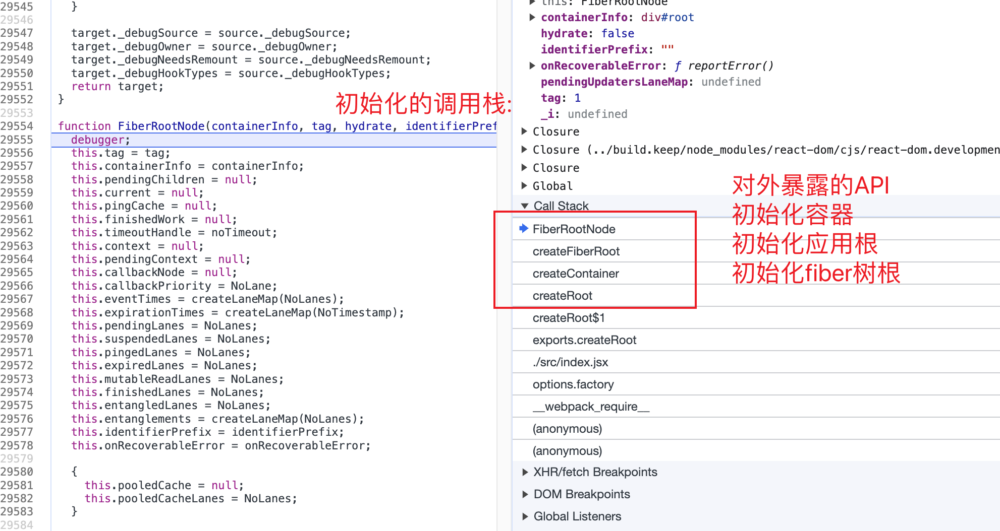

### React 应用入口与首屏渲染

- React 应用入口为什么有两个?
  旧版: `ReactDOM.render`, 只能有一个根容器
  新版: `ReactDOM.createRoot().render`, 可以复用根容器(比如同时渲染两个版本不同的 React)

  
  

- 这两个方法具体代码在哪, 具体使用方式

  旧版文件: ReactDOMLegacy.js

  ```javascript
  ReactDOM.render(<App />, document.querySelector("#root"), callback);
  ```

  新版文件: client/ReactDOM.js

  ```javascript
  const root = ReactDOM.createRoot(<App />);
  root.render(document.querySelector("#root"));
  ```

- 新版特性是指: <font size="4">ConcurrentMode</font>, 所以 createRoot 是开启并发模式的入口

- 渲染回调 `render callback`移除, 平替方式: hook / ref / Promise

### 初始化调用流程概览:

- 初始化: `生成应用根 / 生成fiber 树根 / 合成事件`
  `updateContainer 与 scheduleUpdateOnFiber`
  `createRoot -> createContainer(fiberRoot/rootFiber/listenToAllSupportedEvents) -> render -> updateContainer -> createUpdate -> scheduleUpdateOnFiber`

- 应用初始化的调用栈:

  
