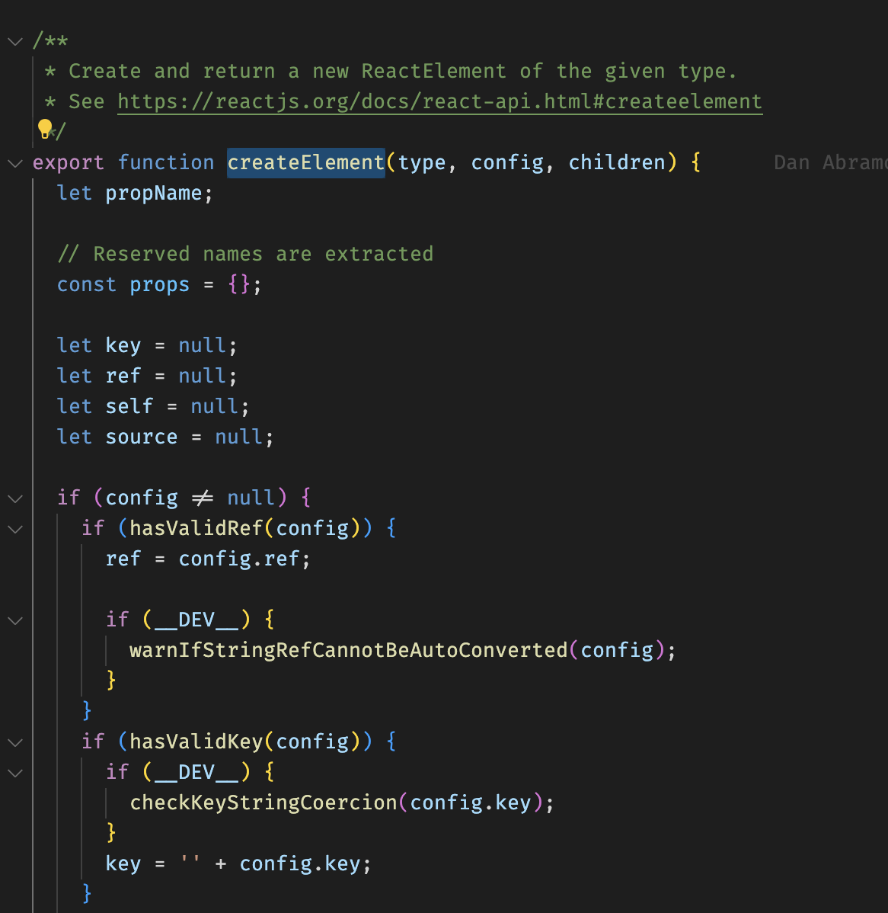
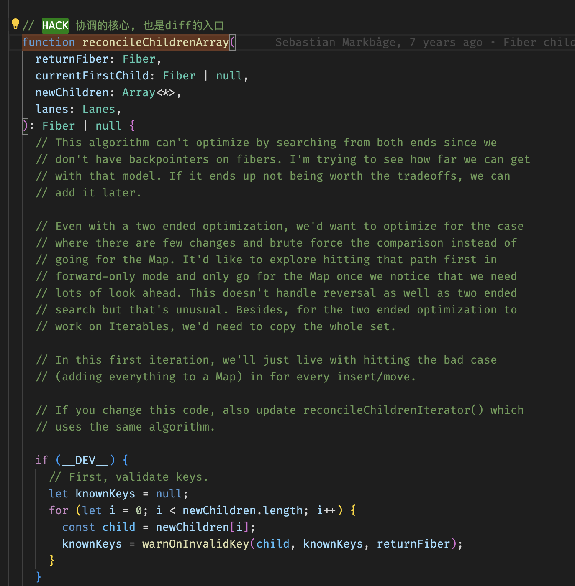

(简略)

### 虚拟 DOM 相关的三个概念: Jsx / Element / Fiber ---> 真实 dom

- Jsx 就是我们日常写的代码, 需要经过编译才能使用(对应 Vue 源码的是 template-compile)

- 编译结果通过`React.createElement`转换成可理解的`Element`元素, 这也是为什么我们没有直接用 React 但必须引入。
  React17 后不需要手动引入了(Automatic Runtime), 提前注入了`react/jsx-runtime`运行时支持。

- Element 嵌套的数组结构, 需要转换成 Fiber 链表才能使用, 这就是协调的主要内容`reconcileChildren`

- React Component 与 React Element 是什么关系
  编译前后的关系!

### 单向转换

- 省略编译的部分

- 从 jsx 到 element: `编译compile` / `createElement` / `REACT_ELEMENT_TYPE`(用于验证合法的element)
  文件: ReactElement.js

  

- 从 element 到 fiber: `协调阶段` / `createFiberFromElement`

  

- 从 fiber 到真实 dom: `提交阶段` / `commitPlacement -> insertOrAppendPlacementNode`

### Fiber

- 具体查看对应小节
