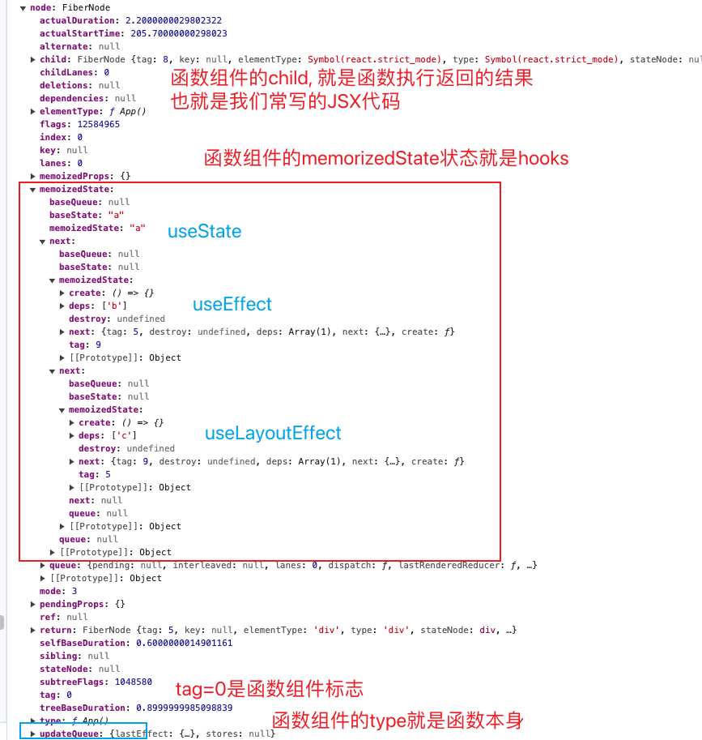
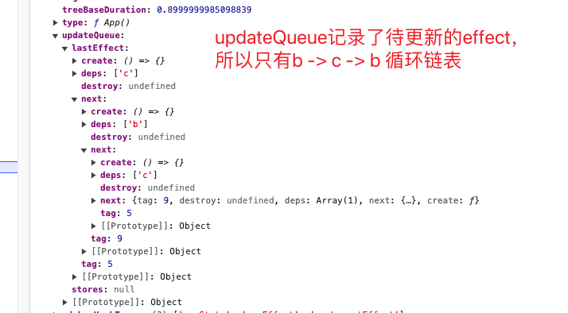

### 理解组件的来源与去处

- 从jsx来, 编译成element, 协调成fiber

### React 中组件类型

- 定义文件: ReactWorkTags.js

- 重点关注: `HostRoot / HostText / HostComponent/ Fragment / ClassComponent / FunctionComponent`

### 原生组件 Host

- HostRoot 原生根节点(最顶层)
  ```javascript
  <div id="root"></div>
  ```

- HostText 具体的文本节点(最底层, 不存在子节点)

- HostComponent 原生 dom 节点, div, p, img 等

- 相应的方法: `isHostParent / getHostSibling / const isHost = tag === HostComponent || tag === HostText;`

### 类组件 Class

- 定义文件: ReactBaseClasses.js

- 如何判断: `createFiberFromTypeAndProps + typeof type === 'function' + Component.prototype.isReactComponent`
  再 createFiber

- 更新: updateClassComponent

- 继承方法: setState / forceUpdate

- 对应的 fiber 节点

### 函数组件 Function

- 如何判断: `createFiberFromTypeAndProps + typeof type === 'function' + isSimpleFunctionComponent`
  再 createFiber

- 更新: updateFunctionComponent

- hook 介入的地方: renderWithHooks

  
  
