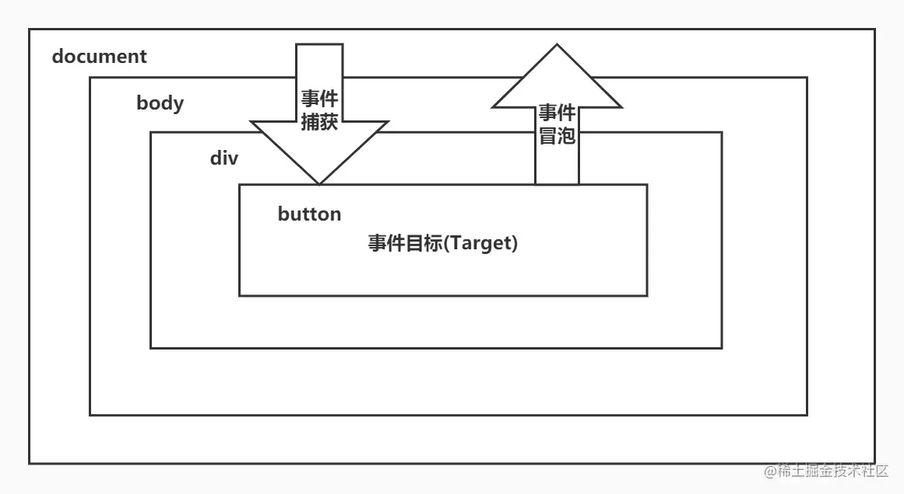

(简略)

### 原生事件流

- 

- 三个阶段: `捕获阶段 --> 目标阶段 --> 冒泡阶段`

- 由于`子元素的事件会冒泡经过父元素`, 让事件委托代理成为了可能, 可以让一个`父元素代为触发所有的事件`,
  而父元素可以通过事件`event.target`得到目标子元素, 知道是谁触发的事件, <font size="4">这就是合成事件的核心思想</font>.

- 合成事件与原生事件执行顺序(非必要不要混用):
  `原生捕获 --> 原生冒泡 --> 合成捕获 --> 合成冒泡`

### 合成事件 SyntheticEvent

- 文件: DOMPluginEventSystem.js -> EventListener.js

- 入口及路径:
  `createRoot -> listenToAllSupportedEvents -> listenToNativeEvent -> addTrappedEventListener -> addEventCaptureListener(捕获事件) / addEventBubbleListener(冒泡事件)`

- 代理挂载在容器 `root` 节点 上, 旧版是直接挂载到 `document` 节点上.

### 事件优先级:

- 文件: ReactEventPriorities.old.js 与 getEventPriority 方法通过事件名转换成对应优先级。

  ```javascript
  export const DiscreteEventPriority: EventPriority = SyncLane;
  export const ContinuousEventPriority: EventPriority = InputContinuousLane;
  export const DefaultEventPriority: EventPriority = DefaultLane;
  export const IdleEventPriority: EventPriority = IdleLane;
  ```

- 离散事件(DiscreteEventPriority) 与 连续事件(ContinuousEventPriority)

### extractEvents 方法

- 根据事件名来分配合成`事件对象event`构造函数, 用于触发时传递给开发者。

### 事件池(新版有变动)

- 事件池是 React 内部维护的一个对象池, 用于复用事件对象, 从而减少内存分配开销 和 方便新元素的事件处理.
