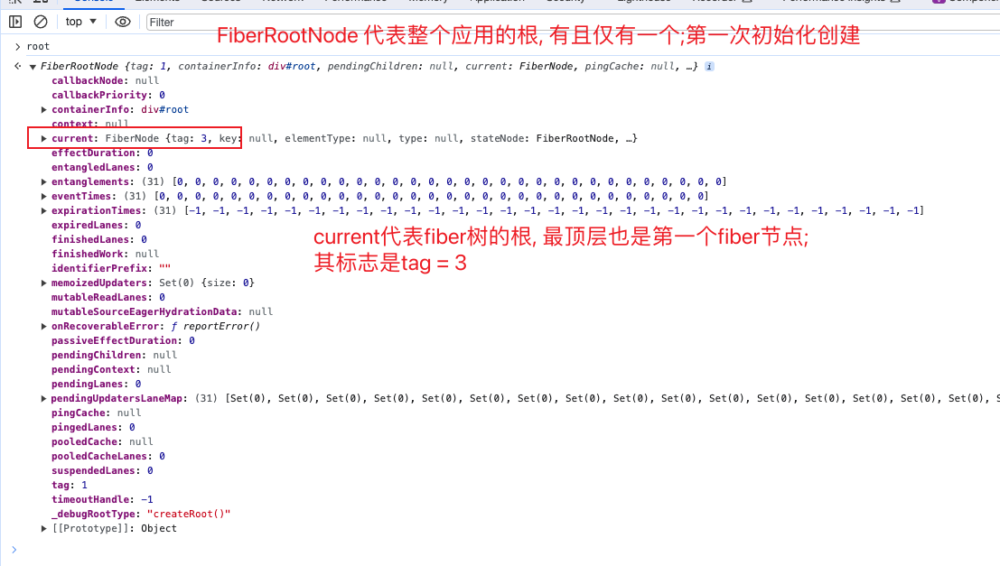

### 什么是 FiberRoot? (应该改名为 reactRoot 或 appRoot)

- 文件: ReactFiberRoot.old.js

- 整个 React 应用的根, 代表着 React 本身, 也代表着 SPA 页面

- 如何创建的? `createContainer -> createFiberRoot -> new FiberRootNode`

### 什么是 RootFiber?

- 文件: ReactFiber.old.js (就是 fiber 节点)

- 可以理解成第一个 fiber 节点, 是整棵虚拟 dom 树的根,
  同一时刻最多存在着两颗 fiber 树, 一颗叫`current` 另一颗叫`workInProgress`, 也就是所谓的双缓存

- 如何创建的? `uninitializedFiber = createHostRootFiber()`

### 两者的关系

  

- 循环引用:
  `root.current = uninitializedFiber;`
  `uninitializedFiber.stateNode = root;`
  `fiberRoot.current.stateNode = fiberRoot`
