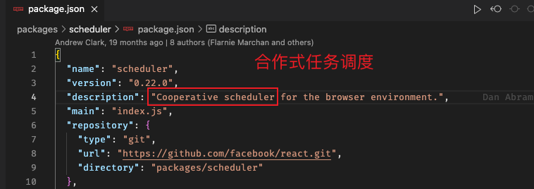
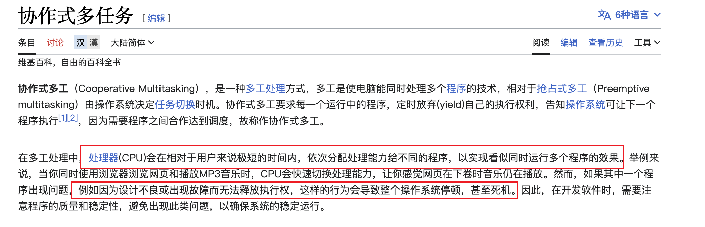

### 合作式任务调度(Cooperative, 也叫非抢占式调度)

- Scheduler 官方说明: 
  抢占式与非抢占式(合作式): 

- 合作式任务调度有很多特性, 在这里我们重点关注的是:
  <font color="green" size="4">依赖任务主动释放控制权, 而非由调度器强制中断任务; </font>
  (仔细理解这句话, 如果一个任务抢占了线程, 但是不归还不释放怎么办?)

- 多个任务不断快速`分配与释放线程控制权`的过程, 宏观层面看是同时执行的(呈现出并发性)

### React 任务调度内容

- 充分参考并模拟实现了: requestIdleCallback这个API

  

- 产生任务(Task)、决定何时、以何种顺序执行任务的过程(minHeap)
  与时间切片紧密相关, 用来平衡任务执行与用户界面响应。

- 具体体现: 优先级(priority) / 时间切片(timeSlice) / 及时响应用户操作(高优先级)

- 好比: 我们要登记一天要做的事情, 并不是越早登记的就越早完成, 会根据`重要性`(priority)调整顺序; 同时任务又有`过期死线`(expirationTime)

### 任务调度与时间切片关联紧密

- 具体: 7.帧循环与时间切片.md

- 调度器只能开启宏任务: `分配控制权`

- 而时间切片可以结束宏任务: `释放控制权`

### 调度器独立的包, 对外的入口

```javascript
function unstable_scheduleCallback(priorityLevel, callback, options) {}
```

### 简单理解下任务的释放与不释放(是否归还控制权)

- 这段代码: `f1 -> f2 -> f3 -> f4`, 执行这段代码, 经过 4 次入栈与出栈, 最终执行栈清空, 自然结束掉了本次执行, 归还了控制权。

- 打个比方, 我们现在占用了一间会议室:

  情况 1. <font color="orange" size="4">我们在时间切片内完成了任务, 只需要释放资源, 就是自然的归还控制权</font>

  情况 2: 我们同样占了一个会议室但是时间大大超出了原定的时间切片, 就会阻塞后续别人的使用(浏览器表现为页面掉帧)

  情况 3: 我们同样占了一个会议室但是永远不归还控制权了(表现为页面直接卡死了), 这种情况在抢占式调度是有调度器强制中断释放的, 但是合作式调度没办法!
