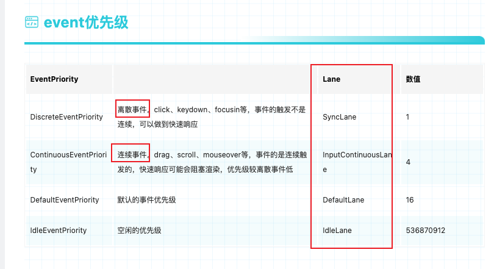

(简略)

### React 中存在三套优先级

- 为什么需要三套优先级: `场景语义` 和 `使用范围`不同

### 1.调度任务的优先级(5 种)

- 文件: SchedulerPriorities.js

### 2.事件优先级(5 种)

- 文件: ReactEventPriorities.old.js

  

### 3.协调中 fiber 的优先级 Lanes(31 种)

- 文件: ReactFiberLane.old.js

- 赛道位置越靠右, 优先级越高

### 三者转换关系, 如何由多到少的?

- 事件名到事件优先级
  `createEventListenerWrapperWithPriority: donEventName -> getEventPriority -> eventPriority`

- lanes 到调度优先级(从 31 个到 5 个的映射)
  `ensureRootIsScheduled: schedulerPriorityLevel -> lanesToEventPriority`

### 涉及到插队和饥饿

- 8.任务插队与饥饿.md
