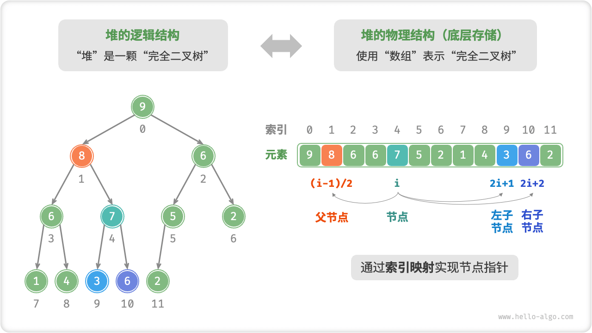

(简略)

### 排序策略

- 朴素的调度策略: 早期的操作系统与早期 React 都是，没有优先级的 `先到先执行`, 模型太简单, 阻塞的体验很差, 无法满足实际场景需求

- 优先队列: 按照优先级排序、但又<font color="red" size="4">不需要完全有序(只需要找出最值), 且适用于动态数据场景</font>(这就是为什么不全排序)

### 维护任务的队列

- 为什么要维护两个队列? 区分是都需要延时执行(delay), 也就是任务是否过期, 增加了代码复杂度, 提高了排序速度
  `Tasks are stored on a min heap`

- taskQueue 已过期任务, 排序依据(sortIndex): expirationTime

- timerQueue 未过期任务, 排序依据(sortIndex): startTime

- requestHostTimeout 和 localSetTimeout 倒计时一个延时任务(单例锁)

- advanceTimers: 检查 timerQueue 过期任务, 移到 taskQueue
  `Check for tasks that are no longer delayed and add them to the queue.`

  ```javascript
  // 每次取任务之前, 都要执行advanceTimers, 检查timerQueue
  advanceTimers(currentTime);
  currentTask = peek(taskQueue);
  ```

### 排序算法与实现: 优先队列(Priority Queue)

- 优先队列是算法, 小顶堆是数据结构实现

- 优先队列无论元素何时被插入, 都可以保证按照它的权重进行逐个出队, 常用于任务调度和'TOP-K 问题'。 // 知乎 1 万个话题找出热榜第 10 名

- O(1)时间就能取到最高优先级的任务, 插入和删除都是 O(longn), 剩余的是否有序不关心, 尤其适用于实时变化的数据。

### 完全二叉堆: 小顶堆(Min Heap)

  

- 文件: SchedulerMinHeap.js

- 常用二叉堆来实现优先队列, 因为符合完全二叉树的定义, 可以直接用数组来存储

- 小顶堆与大顶堆的实现区别, 仅仅在`compare`的比较上

- 如何新增: 先追加到 heap 最后; 再不断向上交换父子元素知道满足定义(siftUp)

- 如何删除: 将最后一个元素覆盖第一个元素; 再不断向下交换父子元素知道满足定义(siftUp)
  堆不能从中间删除元素, 只能删除堆顶的元素

- 父子元素 index 关系公式(完全二叉树特性)
  ```javascript
  const parentIndex = (index - 1) >>> 1;
  const leftIndex = (index + 1) * 2 - 1;
  const rightIndex = leftIndex + 1;
  ```
