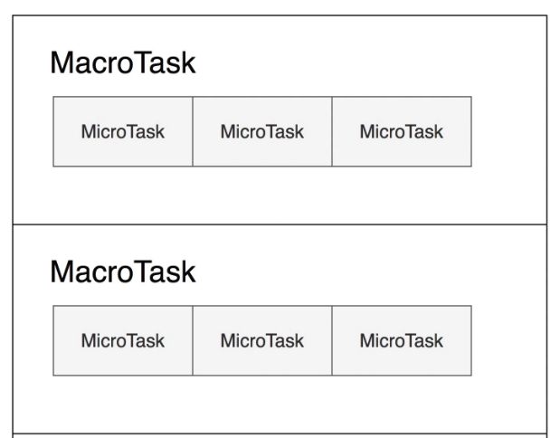

### 宏任务的定义

- 由宿主(如浏览器)发起执行的任务, 单独跑在独立线程中的循环(更高维度); 相反由 v8 引擎内部 产生的任务就是微任务(更低维度)。

- 宏任务 与 事件循环 是不能分开讨论的
  一个事件循环 => 执行一个宏任务 => 期间代码同步执行 => 一次从空栈不断压栈再到清空栈的过程。

- <font color="orange" size="4">一个宏任务包括一个微任务队列, 在宏任务结束后检查执行, 宏任务是无法'无缝连续执行'的, 必定是离散的。</font>
  宏任务产生宏任务是离散的, 微任务产生微任务是连续的

### 理解宏任务为什么是离散的

  

- 嵌套死循环 setTimeou 页面为什么不会卡死? 离散
  ```javascript
  while (true) { setTimeout }
  ```

- 嵌套死循环 Promise 页面为什么会卡死? 连续
  ```javascript
  while (true) { new Proimise }
  ```

- 又或者'协程' 为什么不卡死?
  ```javascript
  while(true) { yield true; }
  ```

- 一个事件循环中, 产生的宏任务会归到下次事件循环执行, 而产生的微任务会在本次事件循环中执行。

- 而在两次事件循环(宏任务)之间, 页面有机会执行帧刷新(layout/repaint), 保证页面流程

### 如何人为产生一个宏任务

- 创造一个宏任务的方式: `setTimeout / setImmediate / MessageChannel(H5)`

- MessageChannel 使用场景: iframe 间跨域通信 / web Worker / vue 中 nextTick 实现 / react 中 Scheduler `开启时间切片`

- setTimeout 作为降级兼容方案, 具有 4ms 的最小间隔; 非活动页面还会更久

- Task 宏任务的选择(执行时机越早越好): setTimeout / setImmediate, 为什么最终用了 MessageChannel

### 限制频繁任务: 可不可以用防抖/节流, 加 loading?

- 在应用层面的手段, 不能解决根本问题: react实现了对应的Transition/Suspense/Offscrean等
