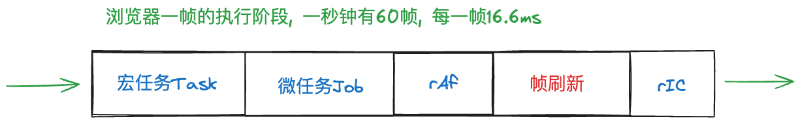
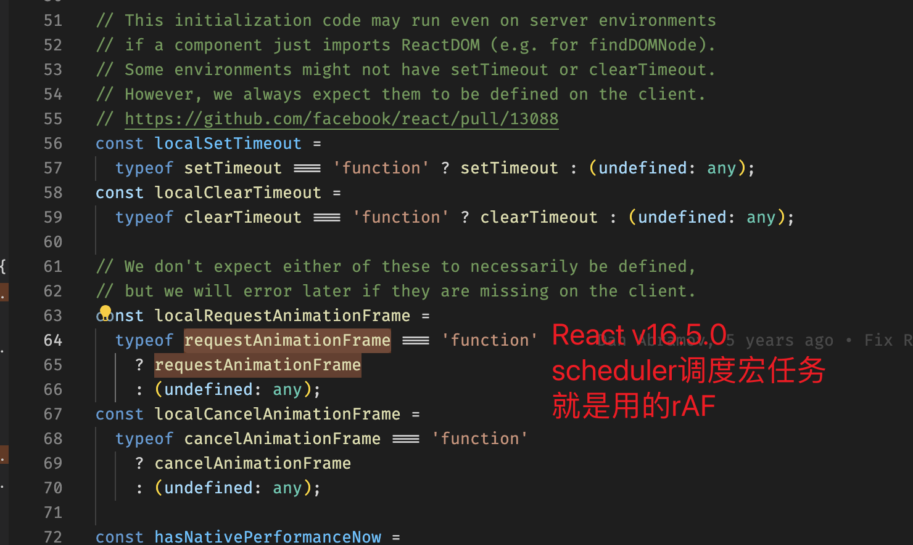

### 帧循环

  

- 每一帧时长: 1000ms / 60fps = 16.6ms/fps

- 每一帧阶段: Task -> Job -> rAF -> reflow/layout -> rIC

- 我们假设一个长任务执行(占用线程)1000ms 会发生什么, 有 60 帧无法执行重排/重绘, 页面产生丢帧与卡顿

- 离散宏任务: 查看 6.离散宏任务.md

### React 如何选择任务的执行时机?

- 原生 requestIdleCallback: 让开发者在空闲时机执行低优先级的任务原生浏览器 API, 最早由 Chrome 提供, 至今也没有完全兼容

  

- 为什么 React 没有选择直接使用, 也是在 Task 时机自行模拟了一个 rIC? <font color="green" size="4">语义不同 / 兼容性考虑 / 无法完全控制</font>
  还有个原因: 要避免在 rIC 中操作 DOM, 不然会触发浏览器强制刷新!(已经本帧绘制完了) --> rAF 是可以 dom 操作的

- 最早 React 选择的是 `requestAnimationFrame`, 为什么放弃了?
  <font color="orange" size="4">语义不同 / rAF 函数有节流, rAF 中触发自身会在下一帧才执行</font>(以为动画在一帧中触发多次是没有意义的)

  

### 时间切片(具体的宏任务)

- 假设一个长任务执行时间需要 1000ms, 如果连续执行页面会持续卡死;
  如果通过`离散`的方式, 一小段一小段增量更新, 就能周期性的将控制权交换给浏览器, 及时重排重绘, 响应用户交互

- 时间切片是调度与协调的载体: `开启时间切片 ->  (调度 & 协调)Loop -> 结束时间切片`

- 开启时间切片: `performWorkUntilDeadline 函数中 startTime = currentTime`

- 结束时间切片: `workLoop 中 shouldYieldToHost` 和 `workLoopConcurrent 中 shouldYield`

- 协作式调度+时间切片:

  ```javascript
  function performWork(workUnit) {
    // ...执行本轮单位任务
    workUnit(); // 在内部也需要适时打断

    // 永远要记住: 需要自行释放控制权
    if (shouldYield()) {
      // 重新开启下一轮的时间切片, 调度执行下一轮任务
      requestIdleCallback(performWork);
    }
  }
  ```

### 总结 \*\*\*

- 理解帧循环: 哪些阶段、如何帧绘制

- 理解宏任务: 为什么要用宏任务, 不能用微任务

- 理解执行时机: 为什么选择用 Task 模拟 rIC

- 理解宏任务选择: 为什么选择 MessageChannel

- 如何开启时间切片

- 如何结束时间切片
