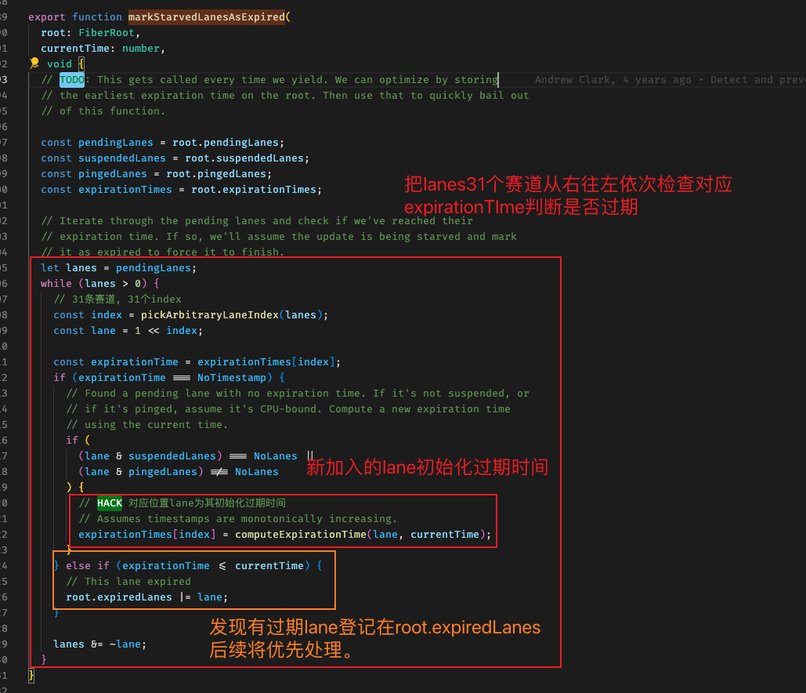

(简略)

(本小节关联 4.副作用与 Update.md)

### 先复习: 调度器是如何取消一个任务

- `cancelCallback / Scheduler_cancelCallback`

  ```javascript
  function unstable_cancelCallback(task) {
    if (enableProfiling) {
      if (task.isQueued) {
        const currentTime = getCurrentTime();
        markTaskCanceled(task, currentTime);
        task.isQueued = false;
      }
    }

    // Null out the callback to indicate the task has been canceled. (Can't
    // remove from the queue because you can't remove arbitrary nodes from an
    // array based heap, only the first one.)
    task.callback = null;
  }
  ```

- 当且仅当一个元素在堆顶小顶堆才能直接 pop, 否则将 task.callback = null 即可

  ```javascript
  if (currentTask === peek(taskQueue)) {
    pop(taskQueue);
  }
  ```

- <font color="red" size="4">预定了一个低优先级任务, 但是来了一个更高优先级的, 低优先级任务就会被取消! 其对应的 lane 会继续保留积压</font>
  这就是为什么 transition 这个 lane, 会存在很多位, 而高优先级 lane 却不需要。

### 关注 ensureRootIsScheduled 函数 \*\*\*

- 从根节点检查是否应该产生新更新任务: 找出 Lanes 中优先级最高的赛道, 转成任务调度的优先级, 最终进入 scheduleCallback

- 在这过程中就会经过: `处理饥饿任务 与 处理批量更新(更新合并) 与 任务插队` \*\*\*

- 先梳理该函数内容:

  ```javascript
  existingCallbackNode 当前存在的更新任务
  existingCallbackPriority 当前存在的任务优先级
  newCallbackPriority 下一个即将新产生的任务优先级
  ```

- 一个 fiber 组件，同时可能有多个需要执行的更新, lane 表示如 `fiber.lane = 001011`
  越靠近右侧优先级越高, 每次读取最右侧的第一个 1 产生对应的更新调度任务。

  ```javascript
  // Determine the next lanes to work on, and their priority.
  const nextLanes = getNextLanes(
    root,
    root === workInProgressRoot ? workInProgressRootRenderLanes : NoLanes
  );

  // We use the highest priority lane to represent the priority of the callback.
  const newCallbackPriority = getHighestPriorityLane(nextLanes);
  ```

- 请注意比较前(旧)后(新)lane 的情况, 不存在新的大于旧的情况, 因为 Lanes 从右往左取状态 1,
  后者只可能等于或小于

### 1.饥饿任务与强制执行

- 进程饥饿是操作系统中的概念, 是指一个低优先级任务(进程), 一直被其他进程抢占资源, 导致无限延后(虽然并没有被阻塞被挂起)。

- `expirationTime 与 expirationTimes` 前者为创建调度任务是产生的过期时间; 后者为长度为 31 的 number 数组, 记录每一个赛道对应任务的过期时间。
  如果对应的赛道任务过期了就会进入`markStarvedLanesAsExpired`被处理

- 如果一个低优先级任务不断被打断, 被延后, 最终会到达<font color="red" size="4">过期时间</font>, 优先级会被强制调为最高

  ```javascript
  // 检查某些lanes是否被其他任务造成饥饿。如果是把他们标记为过期, 等待处理
  // Check if any lanes are being starved by other work. If so, mark them as
  // expired so we know to work on those next.
  markStarvedLanesAsExpired(root, currentTime);
  ```

- 

### 2.BatchUpdate 批量更新(更新合并)

- 当新任务的优先级"等于"旧任务(上一次)的优先级, 将不会产生新更新, 而是直接复用已有的更新任务,
  核心机制是: 利用`Lanes中Transition登记多个更新`, 再在异步更新中, 合并优先级相同的多次更新。

  ```javascript
  // 判断是否已经存在一个更新任务, 尝试复用ta
  // Check if there's an existing task. We may be able to reuse it.
  const newCallbackPriority = getHighestPriorityLane(nextLanes);
  if (existingCallbackPriority === newCallbackPriority) {
    // 优先级没有改变, 我们会复用已存在的更新任务, 退出。
    // The priority hasn't changed. We can reuse the existing task. Exit.
    return;
  }
  ```

  

- 举栗

  ```javascript
  useEffect(() => {
    setState((val) => val + 1); // <-- 产生一个update, 优先级为Normal, 产生一个更新任务
    setState((val) => val + 2); // <-- 产生一个update, 优先级为Normal, 优先级相同, 复用上面的更新
    setState((val) => val + 3); // <-- 产生一个update, 优先级为Normal, 优先级相同, 复用上面的更新

    // 所以结果是: 虽然产生了3个update, 但是因为优先级相同复用已存在的任务, 最终页面只会更新一次, 这就是批量更新。
    // 这里也体现了异步更新的优势, 同步更新是做不到的
  });
  ```

- 特别注意: 更新合并不总是生效的! 需要在同一个有效的 React 上下文中才可以(executionContext), 在 setTimeout/Promise.then/catch/
  这些情况下, 已经脱离了 React 的上下文范围, 此时更新合并会失效, 回退到基础的同步更新模式。
  此外首屏渲染也是同步执行的, 因为需要尽快渲染出页面

### 3.任务插队(高优先级任务打断已存在的低优先级任务)

  

- 打断旧任务

  ```javascript
  if (existingCallbackNode != null) {
    // Cancel the existing callback. We'll schedule a new one below.
    cancelCallback(existingCallbackNode);
  }
  ```

- 创建新任务

  ```javascript
  newCallbackNode = scheduleCallback(
    schedulerPriorityLevel,
    performConcurrentWorkOnRoot.bind(null, root)
  );
  ```

- <font color="blue" size="4">特别注意: 任务打断和插队, 会导致状态更新的不连续(尤其是依赖的状态)</font>, 需要`baseState / baseQueue`维护
  如: 第一步: a = a + 5; 第二步: a = a \* 10; 第三部: a = -a;
  这里的状态是`前后依赖`的, 如果第三步插队, 打断了第二步, 执行了一三计算, 会导致计算结果不正确, React 是如何处理的?

  <font color="orange" size="4">React 只保证最终状态的正确, 但是不保证中间状态的正确!</font>

  具体查看`ReactFiberHooks.old.js 的 useReducer方法`

### 4.被打断的低优先级任务将在下一轮重启

- 在提交阶段的最末尾, 请低优先级的任务坐下一趟车!
  `commitRootImpl -> ensureRootIsScheduled`

  ```javascript
  // Always call this before exiting `commitRoot`, to ensure that any
  // additional work on this root is scheduled.
  ensureRootIsScheduled(root, now());
  ```
