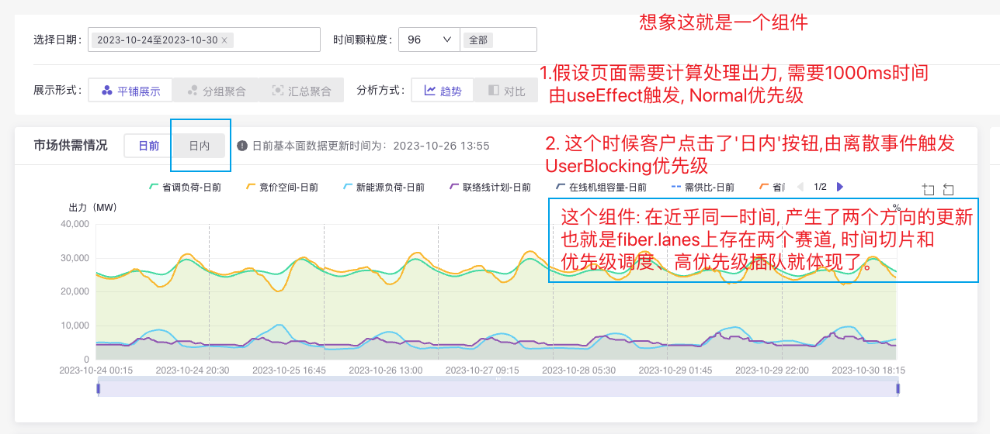
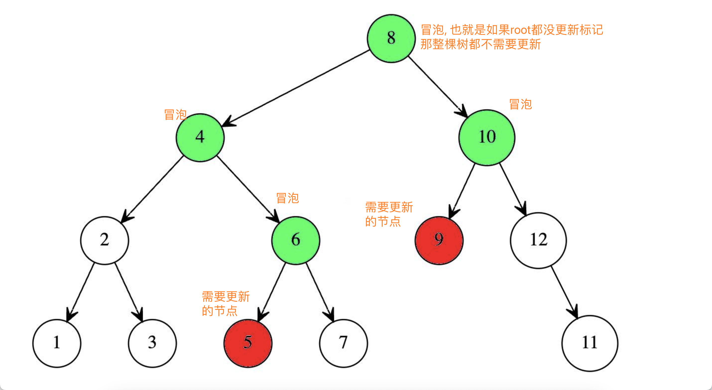

### 旧版 expirationTime 为什么被重构

- 只能表示单一的更新, 无法表示同时存在多个更新交错执行这种`批量`的概念

  Lanes: 如 TransitionLanes 可以表示存在存在 16 把椅子, 最多可以坐 16 个人

  

- 当 React 页面上'同时'存在多个更新时, 该如何表示, 又如何决定哪个更新应该先执行?

### 宏观角度理解 Lanes

- Lanes 是 fiber 协调中用于记录更新的`优先级机制`, 可以让用户交互等高优先级更新被优先执行, 保证用户体验

  我们可以把 lanes 看成银行排队的一排椅子, 可以同时最多坐下 31 个人, 坐得越靠前的优先级越高

- Lanes 是支撑并发模式的底层模型, 配合 Scheduler 可以实现调度、高优先级任务插队、低优先级中断与恢复

### 微观角度理解 Lanes

- 文件: ReactFiberLane.old.js

- lane 与 lanes: 单个与多个, 后者可以表示多个更新, 表示'批量'的概念

- 本质上就是一个 31 为长度的二进制数, 每一位表示一个赛道, 一个具有优先级的更新, 从右往左优先级逐级降低。
  如 `const TransitionLanes: Lanes = 0b0000000001111111111111111000000;` 表示非紧急优先级的任务位置有 16 个

- 高与低: SyncLane 与 TransitionLanes, 为什么越低的优先级状态 1 越多, `任务优先级越低, 被打断、被积压的概率就越高`

- 为什么用二进制? `二进制位 + 掩码` 可以很方便的表示 `多种状态组合`, 如 权限校验、排列组合、状态压缩(贪心和 DP 算法); 以及速度更快适用于大量运算

- Lanes 的运作, 与 Scheduler 不断交换执行往前推进, 增量更新, 同时维护多个更新在 fiber 上按优先级依次执行。

- 运算: 更多查看 `2.Mode与二进制.md`

### 什么是lanse染色树(childLanes 与 subtreeFlags)

- 新版重构 effect 后, 用来标记子树的副作用与优先级, 也就是每个父 fiber 都登记了下一级子节点的状态(可以理解为染色),

  也就是我们在`父级`就知道是否需要继续深入`子树`, 有没有需要我们去更新的内容

  理解这样的'圣诞树与上面挂着的灯泡', 相当于重叠的一大一小两颗树, 大的是整颗 fiber 树,
  小的是存在 lanes 需要更新, 不断向上冒泡形成的子树, 后续遍历只需要遍历染色的小树即可。

  
  

- 核心方法:`bubbleProperties`, 就是具体去执行子节点冒泡, 形成子树, 会在`completeWork`阶段调用
