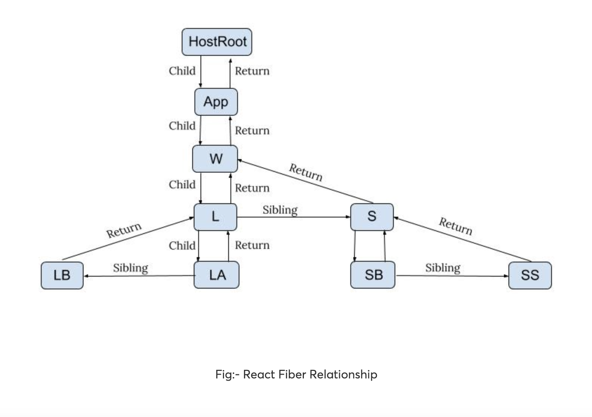
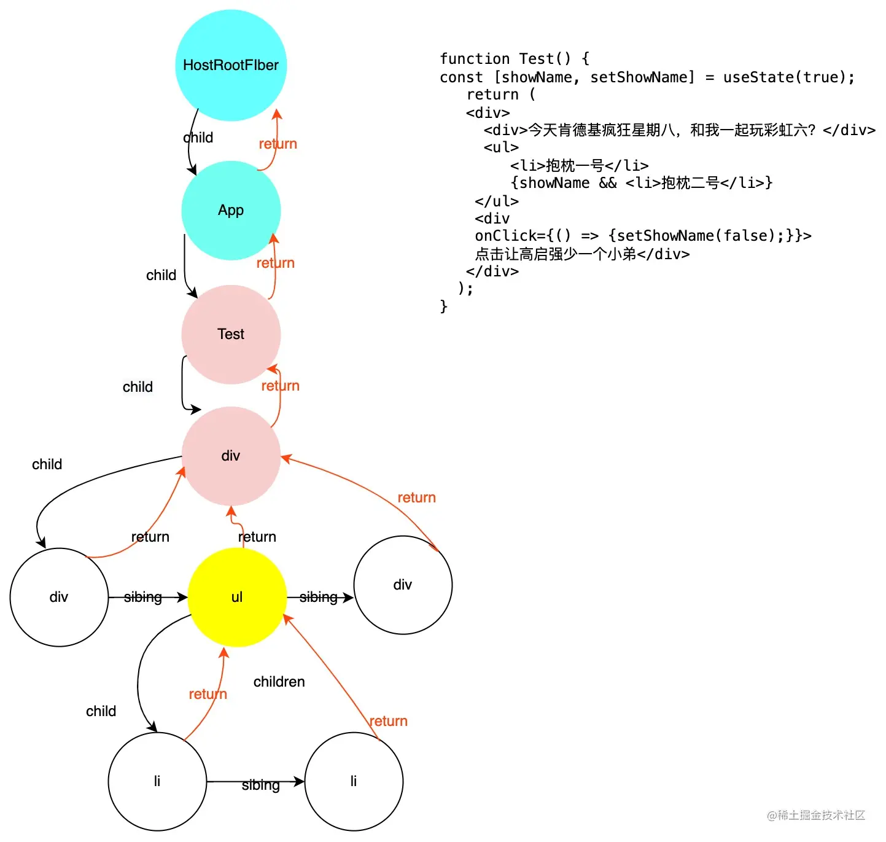
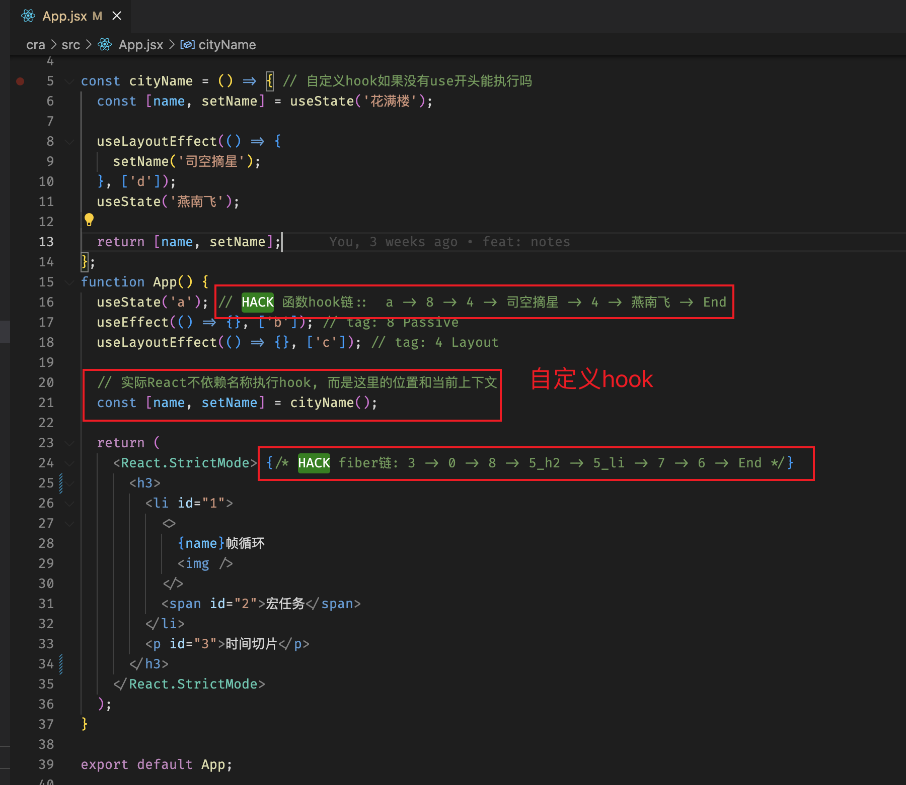

### 宏观理解 Fiber

- `纤程(协程)`: 进程 >> 线程 >> 协程, 简单理解为 <font color="green" size="4">更轻量级的微线程, 更细颗粒度的调度切换</font>

- `协调的基础单位`: 细颗粒度的节点, 可以增量更新

- `虚拟栈帧`: 替代旧版递归执行的系统栈, 用迭代模拟递归, 可以自行控制中断与恢复
  '栈'之间的关系很重要: `child` `sibling` `return`

  

  

- fiber 的发展: Worker(多线程)、generator(原生多协程)、fiber(模拟多协程), 具体查看 `3.React设计.md`

### 微观理解 Fiber

- 文件: ReactFiber.old.js / ReactWorkTags.js / ReactFiberFlags.js

- 链表节点: 就是一个保存节点信息与引用关系的静态 js 对象(单个节点, 构成整颗 fiber 树)

- fiber 自身有很多种类型, 但是按照是否<font color="orange" size='4'>有对应的 dom 节点</font>(帮助我们理解, 尤其是理解提交阶段的行为),
  可以分为`真实 fiber`(如 HostRoot, HostText, HostComponent),
  与`虚拟 fiber`(如 ClassComponent, FunctionComponent)

```javascript
function FiberNode() {
  /* 基础 */
  this.mode = mode;
  this.tag = tag; // fiber类型
  this.key = key; // 层级唯一child
  this.elementType = null; // element.type用于协调
  this.type = null;
  this.stateNode = null; // 对应的真实dom节点(如果有, 也就是真实fiber)
  this.ref = null;

  this.pendingProps = pendingProps; // <- 新旧的属性对象, 用于比对
  this.memoizedProps = null;

  /* 关系(链表) */
  this.return = null; // 父fiber
  this.sibling = null; // 兄弟fiber
  this.child = null; // 子fiber, 单链表, 只关心头节点
  this.index: number; // 标记同层位置, 用于判断是否'Placed'(指交换位置)

  /* Effects副作用 */
  this.flags = NoFlags; // 副作用标记
  this.updateQueue; // Update & UpdateQueue
  this.memorizedState; // fiber的状态, 对于函数组件来说, 就是Hooks
  this.dependencies: Dependencies | null; // 如context依赖
  this.deletions = null; // 删除依赖父节点
  this.subtreeFlags = NoFlags; // <- 该节点下的子树有哪些副作用

  /* 优先级模型 */
  this.lanes = NoLanes;
  this.childLanes = NoLanes; // <- 该节点下的子树副作用都是什么优先级

  /* 双缓存 */
  this.alternate = null; // 记录着这个fiber上一个时刻/上一次更新的快照
}
```

### 关于 Fiber 的注意点

- 注意 fiber 对应的不是我们平时写的组件, 而是更细一层的每个 jsx

- fiber 的类别, 所对应的组件, 具体看 `4.组件类别.md`

- fiber 树的第一个节点(根节点), 永远是`HostRoot`

- 标签内只有文本是不会产生一个 fiber;
  但如果并列存在其他组件则需要产生一个`HostText`

- `<p>空间换时间</p>` 单独文本的这种情况, 不会为文本创建一个 fiber, 而是作为 p 标签的属性(优化路径)

- `<p>空间换时间</p>` 而这种情况则会为文本产生一个 fiber(HostText)

- 首屏渲染没有 current 缓存树, 更新阶段才有

### 函数组件

  

- 一起分析下面这段代码

  ```javascript
  // 3 -> 0 -> 8 -> 5_h2 -> 5_li -> 7 -> 6 -> End
  // 顶层fiber HostRoot=3
  function App() {
    // 函数fiber = 0
    useState("a");
    useEffect(() => {}, ["b"]);
    useLayoutEffect(() => {}, ["c"]);

    // ReactWorkTags.js
    return (
      <React.StrictMode>
        {" "}
        // Mode = 8<h2>
          {" "}
          // HostComponent = 5<li id="1">
            {" "}
            // HostComponent = 5<>
              {" "}
              // Fragment = 7{name}帧循环 // HostText = 6
              
            </>
            <span id="2">宏任务</span>
          </li>
          <p id="3">时间切片</p>
        </h2>
      </React.StrictMode>
    );
  }
  ```
