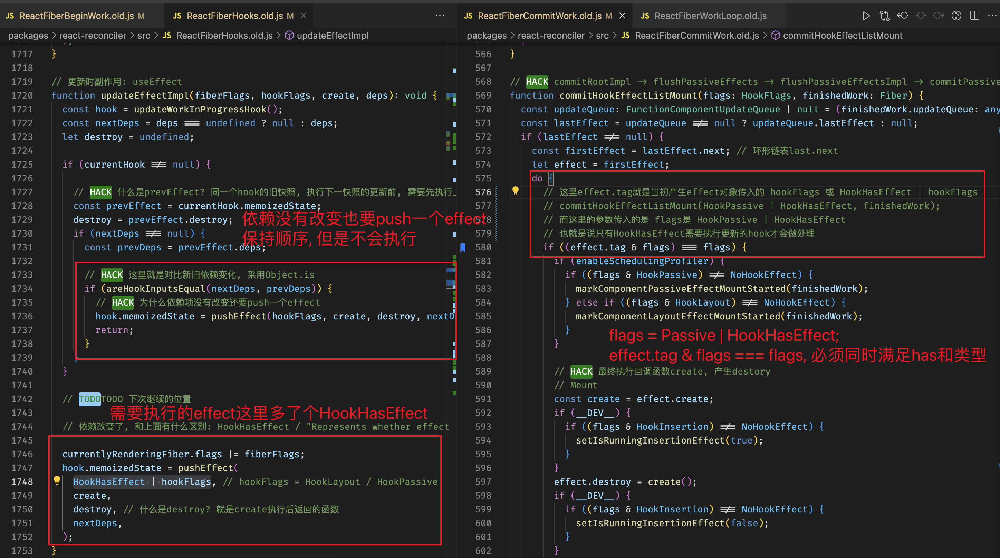
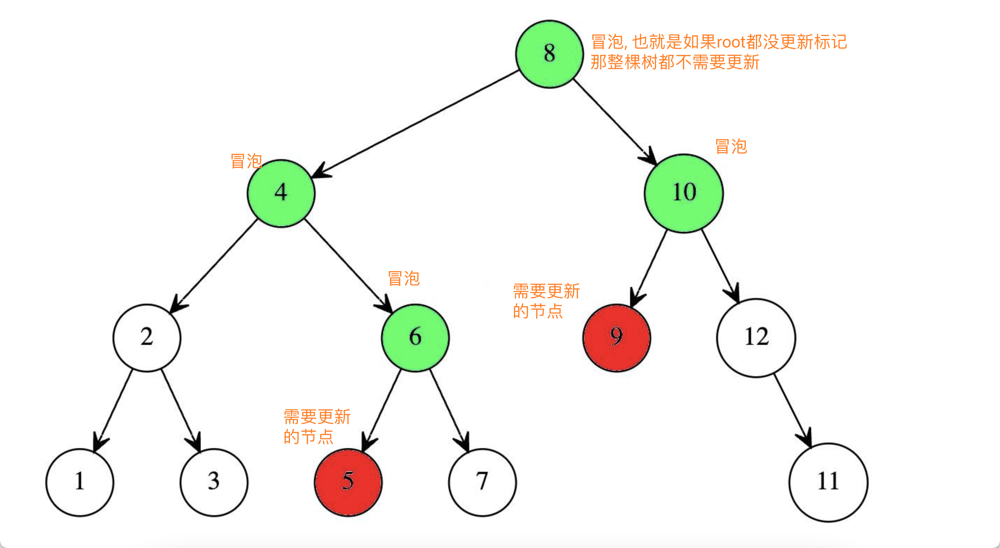

(本小节关联 1.useReducer.md)

### 副作用的概念与产生

- 副作用可以理解成外部带有<font color='red' size='4'>不确定的操作、与纯函数的稳定相对</font>,
  如: `fetch 请求、WebSocket、操作dom、访问存储等`(借用后端的一个概念 '非幂等')

- <font color="orange" size="4">React 设计理念中, 是尽量把副作用作为单独的逻辑链来维护管理的, 与 JSX 所代表的 Code Rendering 是分开的</font>
  <font color="green" size="4">辩证看待: 副作用不可避免, 重要的是如何控制</font>

- React 中对待副作用(side-effect): `多种来源, 统一模型, 集中管理`
  也就是有多个不同场景入口, 如何接入同一套管理机制?

- React 中如何产生了一次更新(effect): 也就是多个场景、多个入口
  (如何低成本的维护这么多种类的更新)
  ```javascript
  useState;
  useReducer;
  this.setState;
  this.forceUpdate;
  flushSync;
  ```

### 副作用类别标签

- 文件: ReactHookEffectTags.js

- 变量: `HookFlags`表示种类; `NoFlags` 与 `HasEffect`而这两个表示有无
  // Represents whether effect should fire.

- 三个有效的副作用标签: `Insertion --> Layout --> Passive`
  分别代表副作用的执行时机: 在<font color="green" size='4'>提交之前、在提交同时、在提交之后</font>。

  

### React 简单版的模型: Update 链表(现在很多文章还停留在这一版)

- 概述: 在 `completeWork` 阶段收集 fiber 的副作用形成`effectList`, 在 commit 阶段遍历各个副作用即可, 避免了子树的二次遍历。(被重构了)

- 为什么被重构升级了? 满足不了什么内容? 因为最新`Transition渲染`相关的新特性 Suspense(OffScrean)等 需要重新遍历子树, 来确认父子组件的关系.

- `额外补充` 本次分享略过了`非紧急过渡更新Transition`相关内容: useTransition、Suspense、lazy、OffScreen 等, 感兴趣可以下来学习下

### 最新的副作用模型: Update 冒泡(bubble)

- `childLanes与subtreeFlags`配合, 子 fiber 向上冒泡, 登记在父级, 从而形成一颗染色的子树

- 核心方法:`bubbleProperties`, 就是具体去执行子节点冒泡, 形成子树, 会在`completeWork`阶段调用

  

### 副作用的统一管理模型(相关概念)

- 文件: ReactFiberConcurrentUpdates.old.js ReactFiberClassUpdateQueue.old.js
  方法: enqueueConcurrentHookUpdate

- `更新合并` 具体查看 8.任务插队与饥饿.md

### update 累计得出 state, 具体内容放到 useReducer

- 涉及到任务的打断恢复与`baseState、baseQueue`
