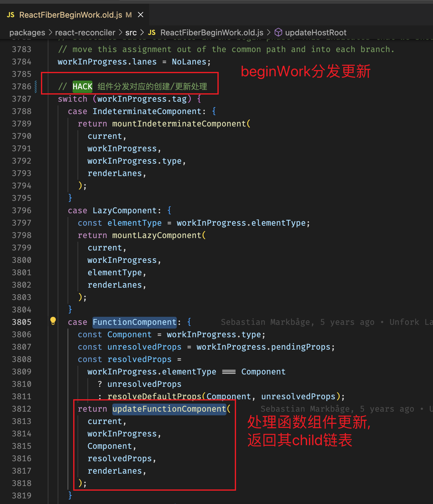
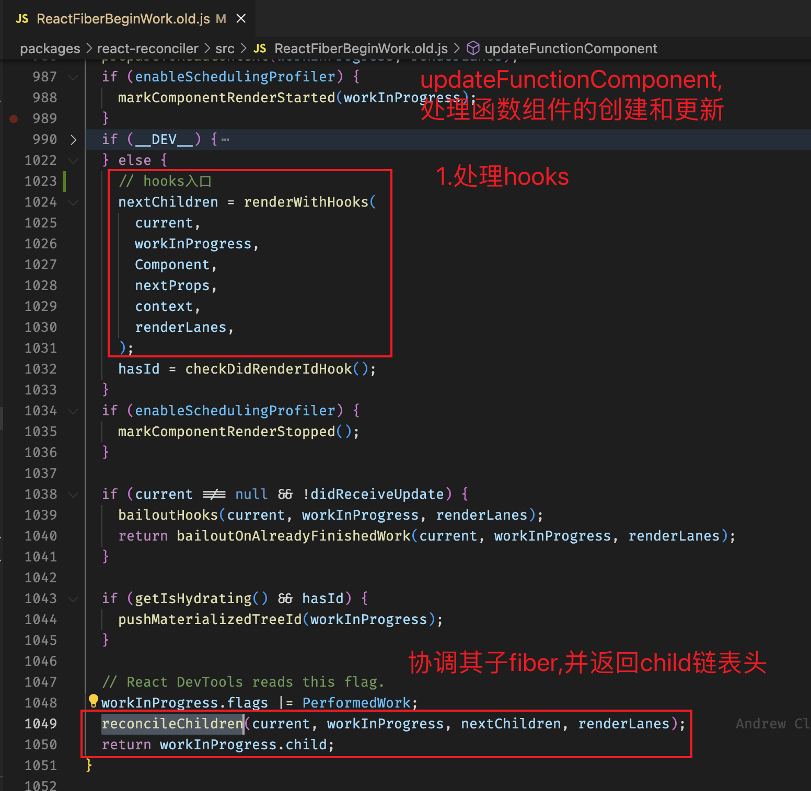
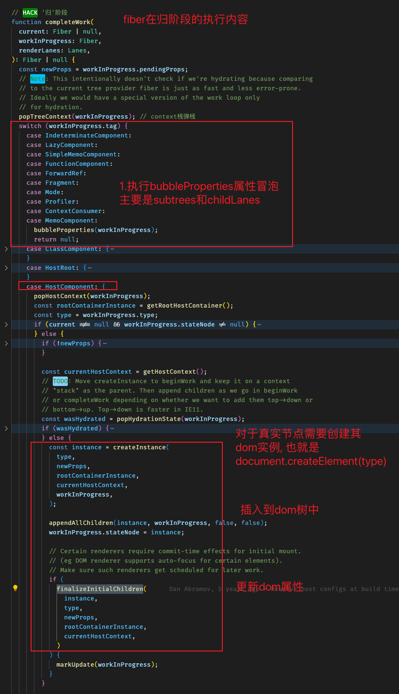

### 栈协调(旧版) 与 fiber 协调(新版)

- 旧版的为什么被重构?
  因为旧版是直接 `DFS 递归整颗 虚拟树`, 无法被中断也无法控制进度, 一旦树的层级过深, 执行时间过长, 页面无法刷新就会卡顿
  (只能等待任务自身释放控制权, 调度器和浏览器都无法强制中断, 抢占式调度是可以的)

- 比如 有个页面上有 1 万个节点, 旧版只能一次性递归查找和比对更新,
  新版引入了时间切片的概念, 在每个切片内增量更新, 实际执行完的时间会更多(调度与中断的成本), 但是却能随时响应用户的操作交互(用户体验优先)

### 递归与迭代

- 递归利用系统栈维护上下文状态与关系, 但无法中断与控制, 无法执行异步

- 迭代 fiber 维护上下文状态与关系, 可以中断与恢复、异步执行, 所以 fiber 也被称为虚拟栈帧

- 调用路径
  `ScheduleCallback -> performConcurrentWorkOnRoot -> renderRootConcurrent -> workLoopConcurrent -> performUnitOfWork`

### 模拟递归之: 先执行'递阶段'

- 文件: ReactFiberBeginWork.old.js

- 有些`从上到下, 从父到子`的逻辑关系, 在递阶段处理

- beginWork: 判断 fiber.tag, 分发组件具体处理函数, 如 `updateFunctionComponent / updateFragment / updateHostComponent`
  具体内容: 执行协调更新(reconcile)

  
  

### 模拟递归之: 后执行'归阶段'

- 有些`从下到上, 从子到父`的逻辑关系, 在归阶段处理

- `completeUnitOfWork -> completeWork`

  执行顺序: A 递 -> B 递 -> C 递 -> C 归 -> B 归 -> A 归
  也就是在递阶段执行的代码, 是顺序的; 归阶段执行的代码, 是逆序的

  

- 主要执行内容:

  1.对于所有类型的组件, 都要执行`bubbleProperties`, 为什么? 子节点(子树)的副作用与优先级向上冒泡
  `subtreeFlags` `childLanes` (为了最新的 Suspense 特性做准备)

  2.对于 HostComponent 类型, 需要生成真实 dom, 并挂载其真实 dom 子树

  ```javascript
  const instance = createInstance(
    type,
    newProps,
    rootContainerInstance,
    currentHostContext,
    workInProgress
  );

  appendAllChildren(instance, workInProgress, false, false);
  workInProgress.stateNode = instance;
  ```

### DFS 的递与归阶段切换的条件

- 当`next为null`, 也就是 child 不存在, 需要一遍查找兄弟节点`sibling`, 一边后退`returnFiber`(completeUnitOfWork),
  然后查找其他子树有没有子节点, 不断交替执行`beginWork`与`completeWork`直到最后退回 root.

  ```javascript
  next = beginWork(current, unitOfWork, subtreeRenderLanes);
  // If this doesn't spawn new work, complete the current work.

  if (next === null) {
    // If this doesn't spawn new work, complete the current work.
    completeUnitOfWork(unitOfWork);
  } else {
    workInProgress = next;
  }
  ```
