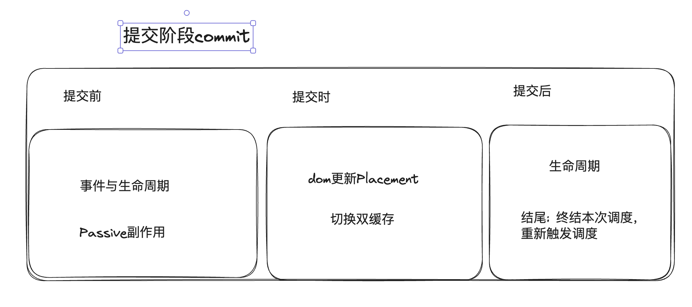

### 关于提交阶段

  

- 文件: ReactFiberWorkLoop.old.js 、 ReactFiberCommitWork.new.js

- 第一、二阶段: 调度与协调所有操作都是<font size="4" color="green">在内存中</font>进行的,
  前面通过增量比对, 标记 📌 出所有副作用与需要更新的节点, 但是还没有实现更新。

- 第三阶段: 真正实现<font size="4" color="red">副作用、真实 dom、生命周期</font>前面的计算结果。

- 提交是一次性的、不可中断的: <font size="4" color="red">防止渲染不一致、保证副作用正确有序的执行。</font>

- 根据生成的 effectList 链表依次执行副作用, 不再遍历整棵树(新版整在重构)

- 最新 Suspense 与 OffScreen 特性可能推翻了上面这条 (HACK)

- 三个子阶段(前、中、后): `BeforeMutation / MutationEffect / MutationLayout`

### 提交入口与 finishedWork

- 我们在协调阶段在根据`current`和`workInProgress`两颗 fiber 树打交道,
  而完成了所有比对的`workInProgress`树即将映射到真实 dom, 我们在 commit 阶段称之为 `finishedWork`

- 在 `performConcurrentWorkLoop` 函数全面执行完协调(renderRootConcurrent), 执行 commitRoot 正式进入提交流程
  ```javascript
  root.finishedWork = finishedWork; // 开始进入提交
  root.finishedLanes = lanes;
  finishConcurrentRender(root, exitStatus, lanes);
  ```

### 三个子阶段

- ```javascript
  commitBeforeMutationEffects; // 阶段1
  // The first phase a "before mutation" phase. We use this phase to read the
  // state of the host tree right before we mutate it. This is where
  // getSnapshotBeforeUpdate is called.

  commitMutationEffects; // 阶段2
  // The next phase is the mutation phase, where we mutate the host tree.

  commitLayoutEffects; // 阶段3
  // The next phase is the layout phase, where we call effects that read
  // the host tree after it's been mutated. The idiomatic use case for this is
  // layout, but class component lifecycles also fire here for legacy reasons.
  ```

### 双缓存切换(更新)的时间点

- 更新双缓存, 将`workInProgress`树替代`current`树的时机: 在 `MutationEffect` 之后, `Layout` 之前。

- ```javascript
  root.current = finishedWork;
  // The work-in-progress tree is now the current tree. This must come after
  // the mutation phase, so that the previous tree is still current during
  // componentWillUnmount, but before the layout phase, so that the finished
  // work is current during componentDidMount/Update.
  ```
