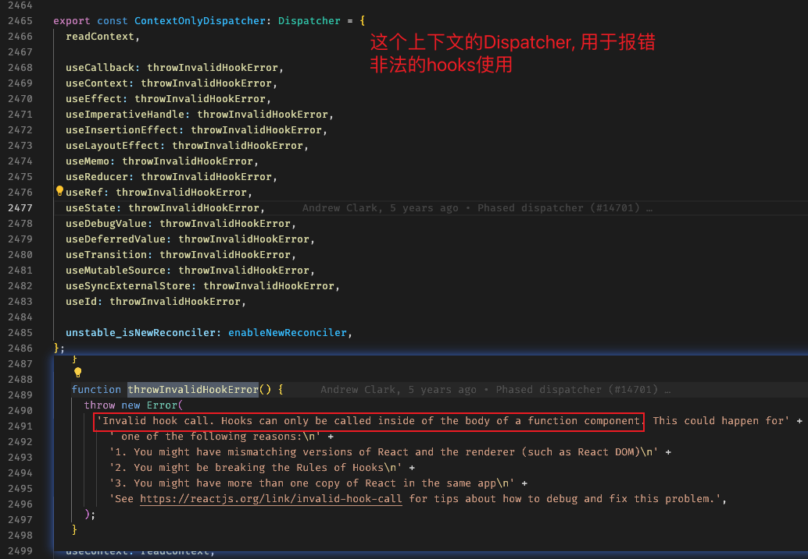

### Hook 的使用规则

- 规范约定自定义 hook 必须以`use`开头, 为什么, React 真的靠这个来辨别 hook 吗?

  答案: 实际上这个是给开发者提醒用的, React 源码中并不依靠名字(而是位置)判断函数是否为 hook。

- 为什么 hook 不能用在循环和判断中使用?

  答案: 因为 hook 是由链表维护的, 是没有名字的, 只能靠`每次相同的稳定顺序`来保证对应更新!
  `currentHook` 与 `wipHook` 新旧 hook 必须一一对应, 否则更新会错位
  `fiber.memorizedState(hook0) -> next(hook1) -> next(hook2) -> next(hook3)... -> hook10(wipHook)`

### 函数组件的更新入口: updateFunctionComponent

- 文件: 从 ReactFiberWorkLoop.old.js 到 ReactFiberHooks.old.js
  从每一个 fiber 迭代, 到组件类别分发, 进入函数组件具体更新, 遇到 hook 处理的入口。
  `performUnitOfWork -> beginWork -> updateFunctionComponent(函数组件更新) -> renderWithHooks --> HooksDispatcherOnRerender`

### Hooks 处理入口: renderWithHooks

- 登记基础变量与清除重置

- 先理解 `currentlyRenderingFiber、 currentHook 和 workInProgressHook` 这些状态是怎么来的

- 执行时机`初始化mount`和`更新update` 与 `ReactCurrentDispatcher`
  所以不同的上下文和执行时机使用不用的 Dispatcher, 对应不同的具体实现, 方便区别对待

  ```javascript
  ReactCurrentDispatcher.current =
    current === null || current.memoizedState === null
      ? HooksDispatcherOnMount
      : HooksDispatcherOnUpdate; // 选择不同执行时机的dispatcher
  ```

### mountWorkInProgressHook 与 updateWorkInProgressHook

- hook 的数据结构对象

  ```javascript
  const hook: Hook = {
    memoizedState: null,

    baseState: null,
    baseQueue: null,
    queue: null,

    next: null,
  };
  ```

### fiber 与 hooks 的关系

- 只有函数 fiber 内有 hook, 在函数 fiber 的 renderWithHooks 执行完后, 会给 dispatcher 赋值为`ContextOnlyDispatcher`,
  这个上下文就是在非函数组件调用 hook dispatcher 是报错提示。

  

- `fiber.memorizedState`: 在函数组件下是保存的是 hook 链, (在 class 组件中表示 state)
  此外, `fiber.updateQueue` 会额外保存副作用的 hook, 采用构造成`update`循环链表的形式。
  也就是 useEffect/useLayoutEffect 对应的 effect 对象同时存在 memorizedState 与 updateQueue 中

### 加深对 hook 的理解

- 推荐阅读下 ahooks 源码中
  `useUpdateEffect` `useAsyncEffect` `usePrevious` `useLatest` `useWhyDidYouUpdate`
