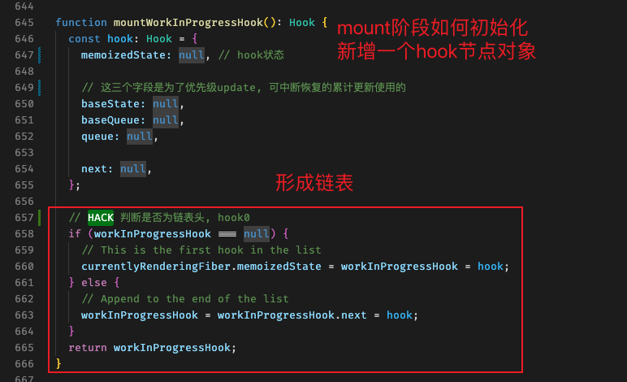

<!-- - useState 相同值为什么也更新
- useReducer 相同值为什么不更新

复杂数据结构, 浅比较造成数据不更新

### useReducer 与 useState 区别与场景

### 最终如何产生一次更新

### reducer 、 action 、 payload -->

<!-- ### 如何产生一次更新: ScheduleUpdateOnFiber

### useState 与 useReducer 的区别和场景

- 新旧值对比: useReducer新旧值相同会拦截掉本次更新; 而useState不会, 依然造成一次更新。 -->

### 从 mountReducer 与 mountWorkInProgressHook 说起

  

- 在挂载阶段执行的 useReducer 代码入口, 首先需要初始化 hook

<!-- 基于baseState计算memoizedState -->
### React如何保证被打断的运算结果的正确性

-  React只保证最终结果正确, 不保证中间结果的正确!

  <!-- TODO -->
- 涉及到的字段: `baseState` `baseQueue` `queue`

- 简单说下`baseState`等三个字段作用: 用于优先级 update, 可终端恢复的累计更新使用
  举个栗子: `memoizedState = f4(f3(f2(f1(baseState))))`; 但是 f3 被打断了, 本次的累计结果为 `memoizedState = f4(f2(f1(baseState)))`,
  此时: 打断前的累计是有效的(f1,f2), 打断后的累计是需要更正的(f4),
  `baseState需要登记为被打断前最后的累计结果, 也就是f2(f1(baseState))`, `baseQueue登记为打断打断前后续的update, 也就是f3,f4`,
  然后在下一轮调度中重新累计打断后剩余的计算: `memoizedState = f4(f3(baseState))`
  (这也是为什么说React不保证)

### Render阶段触发的更新

- 特殊情况: 暴露在render阶段调用!