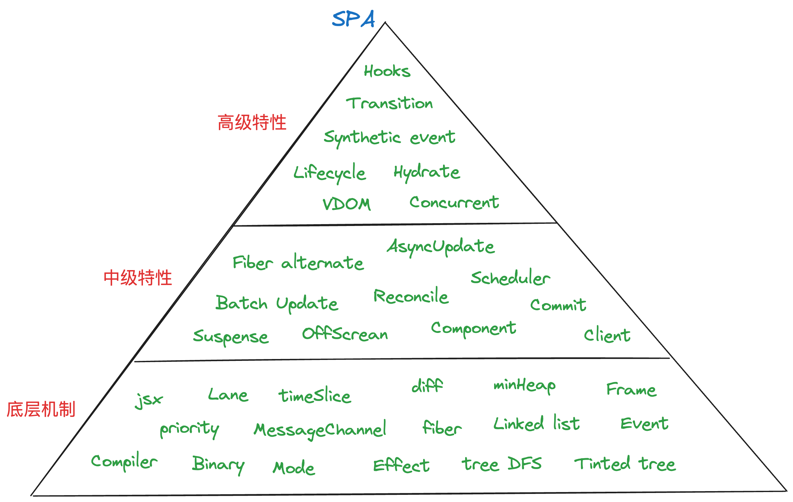
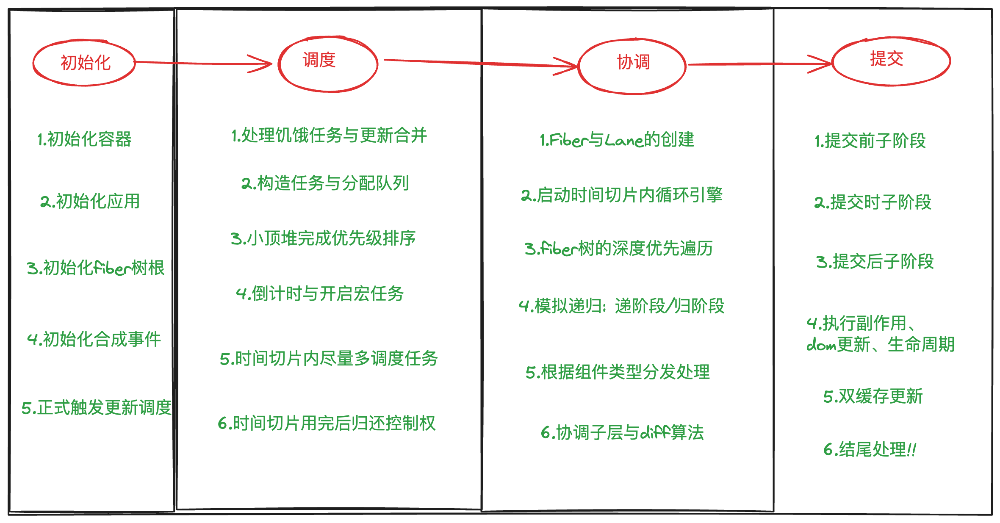

### 一. 《React 源码解读》

    React源码的分析与总结, 构建React核心认知金字塔;
    学习React的设计理念与代码技巧。

### 二. React 核心概念模型

- 我们把 React 特性和概念分层: `底层机制`、`低级特性`、`高级特性`, 逐步贯穿整个知识体系

  

### 三. React 宏观流程

- 三大阶段来理解 React 的执行: `调度`、`协调`、`提交`; 挂载阶段多个初始化

  

### 四. 目录

a. [初始化及基础概念 30min]()
b. [调度(Schedule) 30min]()
c. [协调(Reconcile) 60min]()
d. [提交(Commit) 20min]()
e. [钩子(Hooks) 40min]()

### 五. 分享安排

`预计分成三次分享, 共3个小时`

1. 《React 源码解读: 1.设计理念与任务调度器》
2. 《React 源码解读: 2.协调阶段与 diff 算法》
3. 《React 源码解读: 3.提交阶段与 Hooks 原理》
